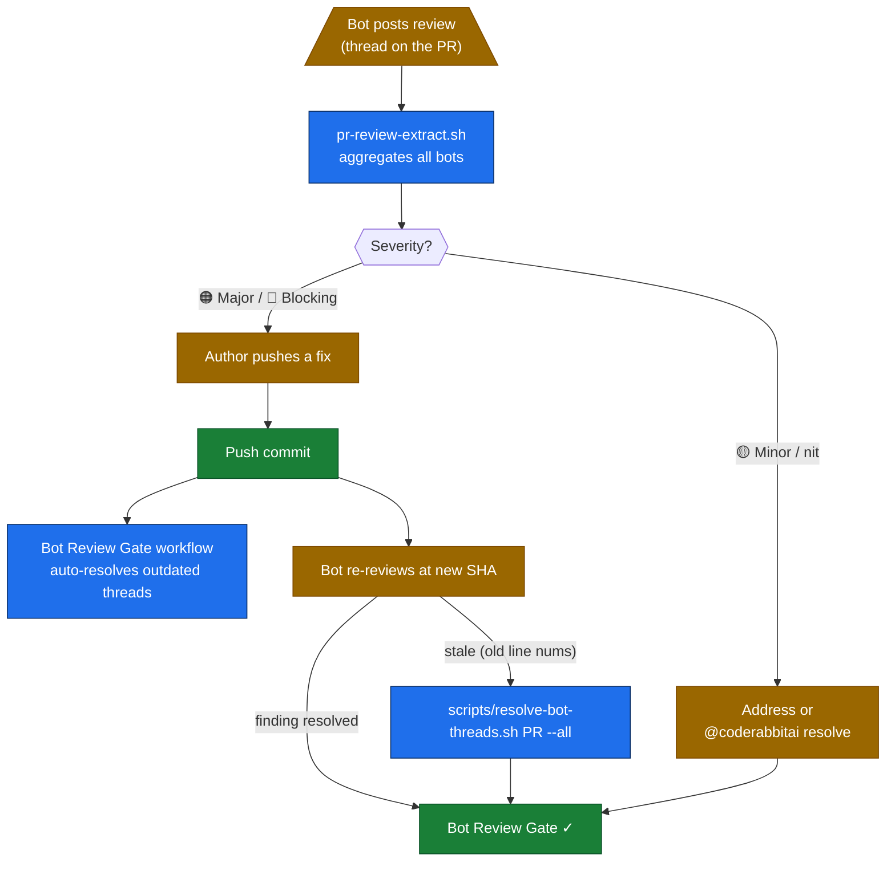

# Bot-resolution framework

How findings from CodeRabbit, Cursor BugBot, Cubic, Sentry Seer, Socket Security,
and Dependabot/Renovate get from "bot posted" to "Bot Review Gate green."

> The infrastructure is already there (`scripts/resolve-bot-threads.sh`,
> `scripts/pr-review-extract.sh`, `.github/workflows/bot-review-gate.yml`,
> per-bot escape syntax). This framework makes the loop **discoverable** and
> documents the per-bot patterns in one place.

## The loop



## Three resolution paths

### Path 1 — fix + auto-resolve (most common, fully automated)

You fix the code and push. The Bot Review Gate workflow runs on every push and
auto-resolves any bot thread where the underlying line moved
(`thread.outdated == true`). The bot re-reviews at the new SHA — if the finding
is actually fixed, no new thread appears.

**No manual step.** Just push.

### Path 2 — fix + manual resolve (when behavior changed but lines didn't)

Some fixes change behavior without moving line numbers — a doc rewrite, a
comment change, a defaults swap. The bot's thread stays "open" because the line
is still there.

Run the on-demand resolver:

```bash
# Resolve only OUTDATED threads (default — safe; same as the workflow does)
scripts/resolve-bot-threads.sh <PR>

# Resolve ALL unresolved bot threads (agent attests fixed)
scripts/resolve-bot-threads.sh <PR> --all
```

The script only touches bot-authored threads — it'll never close a human's
conversation. Authorship is checked by GitHub App **type**, not login, so new
bots (cursor, cubic, sentry, …) are handled without code changes.

### Path 3 — bot-specific commands (per-bot syntax)

Some bots accept commands posted as comments. The framework documents the
recognized syntax per bot:

| Bot | Command | Effect |
|-----|---------|--------|
| CodeRabbit | `@coderabbitai resolve` | Closes the thread the comment is on |
| CodeRabbit | `@coderabbitai pause` | Stops further reviews on this PR |
| CodeRabbit | `@coderabbitai review` | Forces an immediate re-review |
| Cursor BugBot | `[Cursor: ignore]` | Suppress the finding in body |
| Cubic | (no command — uses thread resolution) | n/a |
| Sentry Seer | (no command — links to Linear issue) | n/a |
| Socket Security | (no command — alerts are advisory) | n/a |
| Dependabot | `@dependabot rebase` / `merge` / `ignore this version` | Standard set |
| Renovate | `@renovatebot rebase` / `merge confidence` / pin | Standard set |

When in doubt: post a brief comment justifying the resolution, then run
`scripts/resolve-bot-threads.sh <PR> --all`.

## What "Bot Review Gate" actually checks

A required CI check that fails when **any unresolved blocking bot thread** exists
on the PR. "Blocking" is what each bot considers a major/critical finding (CodeRabbit
🟠 Major or 🔴 Critical; Cursor BugBot any finding; Cubic any "blocking" classification).

The gate runs `scripts/pr-review-extract.sh <PR>` to aggregate findings into one
structured summary, posts a sticky comment with the aggregate, and reports
`pass`/`fail` based on whether any blocking thread is currently unresolved.

Idle nits and "Quick win" suggestions are surfaced in the sticky comment but
**do not block**.

## Sentry-specific: from PR Seer finding to Linear issue

Sentry Seer posts a finding on the PR; the foundation observability standard
([`frameworks/observability/README.md`](../observability/README.md)) wires
**Sentry → Linear** sync. The Linear issue is the durable artifact (Sentry's
PR comments rot when the PR closes); the foundation Linear team is
`LINEAR_TEAM_ID` per env-registry.

Resolution lives in Linear: close the issue when the underlying error is fixed
(or write a "won't fix — known limitation" comment with reasoning). The
foundation does **not** sync Linear back to Sentry — Sentry tracks live; Linear
tracks deliberation.

## Cursor BugBot — fix-all flow

Cursor offers a one-click "Fix all" link in its top-level review comment
that opens Cursor with all findings as pending edits. The foundation accepts
the fix-all flow as long as:

1. Each suggested edit is committed individually (1 commit per finding) for
   reviewability.
2. The agent reads and **endorses** each edit before committing — Cursor
   sometimes suggests style-only changes that don't match the foundation's
   conventions; reject those.

## Dependabot / Renovate — when to auto-merge

PRs from `dependabot[bot]` or `renovate[bot]` that touch only `package-lock.json`,
`go.sum`, `Cargo.lock`, or equivalents auto-merge if:

- All required checks pass
- No major version bump (semver `^X.Y.Z` → `X+1.*` requires human review)
- No security advisory severity ≥ high (those need a security-team look)

Configured via `.github/auto-merge.yml` per the workflow-engines framework.

## Audit trail

Every bot resolution lands an audit comment on the PR (posted by the workflow
or the agent running the resolve script) noting:

- Bot name
- Thread URL
- SHA at resolution
- Reason (auto-outdated / fix-pushed / attestation / per-bot command)

This is the artifact a future maintainer reads to understand "why was this
finding closed?"

## What NOT to do

- **Don't suppress findings without an audit comment.** A silent resolve is
  un-reviewable.
- **Don't add bot logins to a generic "skip" list.** The framework checks
  GitHub App **type** for a reason — new bots inherit the same handling.
- **Don't `--no-verify` past a Bot Review Gate failure.** The gate exists
  because we kept missing real findings. Resolve, don't bypass.
- **Don't resolve another agent's threads.** Bots posting back-and-forth on
  the same thread is fine; agents closing each other's open conversations is
  not.

## See also

- [`docs/diagrams/flowcharts/bot-resolution.md`](../../docs/diagrams/flowcharts/bot-resolution.md) — the full diagram
- `scripts/resolve-bot-threads.sh` — the runner
- `scripts/pr-review-extract.sh` — the aggregator
- `.github/workflows/bot-review-gate.yml` — the required CI check
- [`frameworks/observability/README.md`](../observability/README.md) — Sentry → Linear sync

## Diagram

The bot-finding resolution lifecycle is drawn in [`docs/diagrams/flowcharts/bot-resolution.md`](../../docs/diagrams/flowcharts/bot-resolution.md) (catalog: `docs/diagrams/README.md`).
