# Harvest — cross-repo pattern promotion

How good patterns born outside the foundation get pulled into it, gated, and then
shipped back out to every consumer.

> If `docs/promotion.md` is the "staging → canonical" loop *inside* the foundation,
> `frameworks/harvest/` is the "sibling repo → staging" loop into the foundation.

## When to harvest

Harvest a pattern when **all four** are true:

1. It's proven in **2+ spokes** (not just one — single-repo patterns aren't generic enough).
2. It's **cross-product** (no `WAVE`, `wave-surfer`, prod Supabase IDs, internal service
   names baked in — those parts must be removable).
3. It's a **pattern**, not an instance (a workflow, a schema shape, a script that
   takes config — not a one-off configuration).
4. It's **stable** (no active churn in the source — wait for it to settle).

## Flow

```mermaid
flowchart LR
    SR["Sibling repo<br/>pattern proven in 2+ spokes"]:::external
    Harvest["scripts/harvest-from-repo.sh<br/>(copies file with provenance frontmatter)"]:::gated
    ST["staging/&lt;source-repo&gt;/<br/>faithful, un-gated"]:::staging
    Promote["docs/promotion.md<br/>(strip business refs · pass every gate)"]:::gated
    CN["frameworks/ or rules/<br/>fully gated canonical"]:::gated
    CONS["Consumers<br/>plugin + vendor + submodule"]:::pass

    SR --> Harvest --> ST
    ST --> Promote --> CN
    CN --> CONS

    classDef external fill:#9a6700,stroke:#7d4900,color:#fff
    classDef staging fill:#9a6700,stroke:#7d4900,color:#fff
    classDef gated fill:#1f6feb,stroke:#0a3069,color:#fff
    classDef pass fill:#1a7f37,stroke:#0a5328,color:#fff
```



Two stages, on purpose:

- **Harvest** preserves the artifact byte-for-byte — staging is faithful upstream
  reference, and that fidelity is the whole point (style/dedup gates intentionally
  skip `staging/`).
- **Promote** is where the rewrite + gating happens — strip business specifics,
  generalize tool refs, pass markdownlint + codespell + skill-validate +
  file-size + claude-api-shape.

## Three ways to start a harvest

### 1. Foundation-initiated (most common)

A foundation maintainer sees a pattern in a sibling repo (e.g. via routine
review, a Linear ticket, a Sentry pattern) and decides to pull it in.

```bash
# From the foundation root:
bash scripts/harvest-from-repo.sh \
  --source wave-av/wave-spoke-chassis \
  --path apps/spoke/lib/touch-nav.ts \
  --reason "auto-spin product-nav proven in 11 spokes; pattern, not instance"
```

The script:

1. Clones the source path into `staging/<source-repo>/<original-path>` (preserving
   the directory structure).
2. Prepends provenance frontmatter (see `frontmatter-template.md`).
3. Opens a draft PR with the `harvest:` label and a link back to the source commit.
4. Leaves the rest of the promotion work to the human or follow-up PR.

### 2. Spoke-initiated

A spoke maintainer files an issue with the `harvest-candidate` label
(`.github/ISSUE_TEMPLATE/harvest-candidate.md` — see below). The
`harvest-candidate` weekly workflow picks it up, runs the same script, and
opens the harvest PR.

### 3. CI-initiated (drift detection)

A nightly job scans 5+ sibling repos for cross-repo duplication via fuzzy
file hashing. When 3+ repos implement substantially similar files (e.g. the
same hook script with minor variations), a Linear issue + harvest-candidate
issue opens automatically.

This is the most automated path but also the noisiest — false positives are
expected. The issue triage workflow filters; the maintainer reviews.

## What a harvest PR looks like

A harvest PR ONLY touches `staging/`:

```
staging/
└── wave-spoke-chassis/
    └── apps/spoke/lib/touch-nav.ts    ← exact copy with provenance frontmatter
```

It does **NOT** touch `frameworks/` or `rules/`. That's promotion territory and
ships as a separate PR after the staging file has been reviewed for fitness.

The PR description follows the `harvest-pr-template.md` and links to:

- Source: `https://github.com/wave-av/<source-repo>/blob/<sha>/<path>`
- The 2+ spokes where the pattern is proven (with file references)
- A promotion plan (which canonical dir, what generalizations are needed)

## What NOT to harvest

- **Generated files** — re-generate in foundation, don't copy.
- **Vendored dependencies** — they belong in the source repo or `staging/_external/`.
- **Half-finished experiments** — wait for the source to stabilize.
- **Anything matching the open-core deny patterns** — `scripts/sync-public.sh`
  will hold it back at publish time anyway; harvesting it just wastes review.
- **Anything already in canonical form** — search `rules/`, `frameworks/`,
  `taxonomy/` before harvesting. Duplication is failure.

## Audits

Periodic sweeps of the sibling repos for 4-true candidates. Each row in an audit is a
follow-up harvest PR; re-run before acting on a row (a "stable" judgment expires).

- [`audit-2026-05-31.md`](audit-2026-05-31.md) — first sweep: WSC + spoke chassis + edge cluster.

## See also

- `frontmatter-template.md` — the provenance header every harvested file gets
- `harvest-pr-template.md` — PR description template
- `docs/promotion.md` — staging → canonical (the next step after harvest)
- `scripts/harvest-from-repo.sh` — the runner
- `.github/ISSUE_TEMPLATE/harvest-candidate.md` — spoke-initiated trigger

## Diagram

The harvest → promote loop is drawn in [`docs/diagrams/flowcharts/harvest-promote.md`](../../docs/diagrams/flowcharts/harvest-promote.md) (catalog: `docs/diagrams/README.md`).
